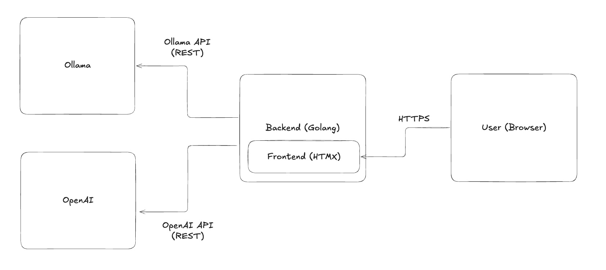

# Coda: Run Local GenAI Models on Cloud Run with Go

## Overview

Coda is a production-ready application that demonstrates deploying GenAI models on Google Cloud Run with GPU acceleration. The project integrates a Go web application with both OpenAI and locally-hosted models via Ollama. It implements observability through Langfuse and provides Terraform configurations for Cloud Run deployment with GPU support.

### Architecture



### Demo


### Core Features

1. **Local GenAI Integration**: Direct integration with Ollama for running open-source LLMs locally or in your own infrastructure.
2. **GPU-Accelerated Cloud Deployment**: Terraform configurations for deploying to Google Cloud Run with GPU support for optimal inference performance.
3. **Server-Side Rendering UI**: Go templates with htmx for a responsive, JavaScript-minimal frontend without complex build processes.
4. **LLM Observability**: Comprehensive tracing and analytics with Langfuse to monitor model performance, costs, and user interactions.

### Codebase Structure

```sh
coda/
├── cmd/                  # Application entry points
├── config/               # Configuration management
├── docker/               # Docker configurations
├── gguf/                 # GGUF model management
├── infrastructure/       # Terraform IaC for Google Cloud
└── internal/             # Core application packages
    ├── config/           # Configuration loading
    ├── frontend/         # Web UI components
    ├── infrastructure/   # Server and middleware
    ├── llm/              # LLM integration layer
    │   ├── ollama/       # Ollama provider
    │   ├── openai/       # OpenAI provider
    │   └── langfuse/     # Observability
    ├── logger/           # Structured logging
    └── review/           # Code review features
```

## Prerequisites

- [Go](https://golang.org/dl/) (v1.24.0 or later)
- [Terraform](https://www.terraform.io/downloads.html) (latest stable version)
- [Docker](https://docs.docker.com/get-docker/) (for containerization)
- [Google Cloud SDK](https://cloud.google.com/sdk/docs/install) (for deployment)

## Setup Instructions

### Cloning the Repository
```sh
git clone git@github.com:descarty-org/coda.git
cd coda
```

### Environment Configuration

Copy the `.env.example` file to `.env` and fill in the required variables.

| Category | Variable | Description | Required |
|----------|----------|-------------| -------- |
| Global | `CODA_ENV` | Environment name (e.g., `local`, `dev`, `prod`) | - |
| Server | `PORT` | Port number for the server (default: 8080) | - |
| | `HOST` | Hostname for the server to listen on (default: 0.0.0.0) | - |
| | `ALLOWED_ORIGINS` | Comma-separated list of allowed origins | - |
| LLM | `OPENAI_API_KEY` | API key for OpenAI | Yes |
| | `OLLAMA_BASE_URL` | Base URL for the OLLAMA REST API | - |
| | `LANGFUSE_PUBLIC_KEY` | Public key for Langfuse observability | - |
| | `LANGFUSE_PRIVATE_KEY` | Private key for Langfuse observability | - |

### Local Development

#### Running Ollama Locally

```sh
ollama run "yottahmd/tiny-swallow-1.5b-instruct" # Download the model
ollama serve # Start the REST API server
```

#### Running the Server

```sh
make run
```

The web interface will be available at http://localhost:8080

To run the server with a custom Ollama base URL:
```sh
OLLAMA_BASE_URL=http://localhost:11434 make run
```

#### Testing

Run the test suite with coverage reporting:

```sh
make test
```

#### Linting and Code Quality

```sh
make lint
```

### Deployment

Coda can be deployed to Google Cloud Run with GPU support:

Note: Refer to the [infrastructure README](infrastructure/README.md) for detailed deployment instructions.

1. Set up your Google Cloud project:
   ```bash
   export PROJECT_ID=your-project-id
   gcloud config set project $PROJECT_ID
   ```

2. Copy `infrastructure/environments/exp/terraform.tfvars.example` to `terraform.tfvars` and fill in the required variables.

3. Initialize Terraform:
   ```bash
   cd infrastructure/environments/exp
   terraform init
   ```

4. Apply the Terraform configuration:
   ```bash
   terraform apply
   ```

## Technical Requirements

### GPU Configuration

Ollama on Cloud Run with GPU support requires the following resources:

```hcl
resources {
  limits = {
    "cpu" = "8"
    "memory" = "32Gi"
    "nvidia.com/gpu" = "1"
  }
  startup_cpu_boost = true
}
```

### Scaling Considerations

The default configuration includes scaling to zero instances when there are no requests. You can adjust the scaling and concurrency settings based on your requirements:

```hcl
scaling {
  min_instance_count = 0
  max_instance_count = 1
}

# Configure concurrency
max_instance_request_concurrency = 4
```

- **Cold Start**: Be aware that the first request may experience cold start latency (up to 1 minutes) as the model is loaded into GPU memory.
- **Instance Scaling**: The default configuration limits to a single instance to control costs.

## References

- [Ollama](https://github.com/ollama/ollama)
- [Langfuse](https://langfuse.com/)
- [Tiny Swallow 1.5B](https://huggingface.co/SakanaAI/TinySwallow-1.5B)
- [Google Cloud Run with GPUs](https://cloud.google.com/run/docs/configuring/services/gpu)
- [htmx](https://htmx.org/)

## Contributing

Feel free to contribute to the project by opening an issue or submitting a pull request.

## License

This project is licensed under MIT License.

**Note:** The Tiny Swallow 1.5B model used in this project is not covered by this license. For the model's licensing information, please refer to the [Hugging Face page for TinySwallow-1.5B](https://huggingface.co/SakanaAI/TinySwallow-1.5B).
